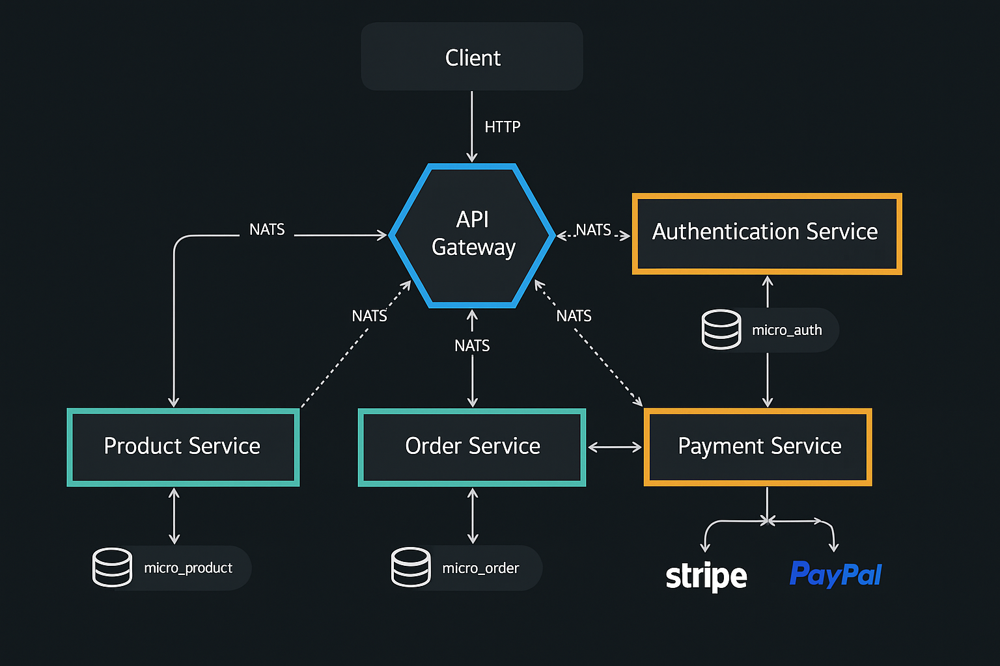

# Microservices-Based E-commerce System

> **🌍 Documentación en Español:** Si prefieres leer esta documentación en español, consulta [README_ES.md](./README_ES.md)

## 1. Introduction

This repository contains the implementation of a backend system for an e-commerce platform, designed using a microservices architecture. The goal is to provide a scalable, maintainable, and resilient solution to manage key functionalities such as user authentication, product catalog, order processing, and payment management.

The system is built using **NestJS (TypeScript)**, leveraging modern design patterns like **Clean Architecture (Hexagonal Architecture)** and **CQRS**. Communication between services is primarily asynchronous via **NATS**, and data persistence is managed with **Prisma ORM**. The entire environment is containerized with **Docker** and orchestrated using **Docker Compose** to facilitate development and deployment.

## 2. General Architecture

The system follows a microservices pattern, where each service encapsulates a specific business capability. An **API Gateway** acts as a Single Point of Entry (SPOE), simplifying client interaction and providing a layer of security and routing.

### 2.1. Main Components

* **API Gateway (`api-gateway`):**
  * Exposes the unified RESTful API to clients.
  * Routes requests to the corresponding microservices via NATS (RPC and events).
  * Manages initial authentication (JWT validation).
  * Implements API versioning (via URI).
  * Aggregates responses (if necessary).
  * Provides centralized API documentation (Swagger/OpenAPI).
* **Auth Microservice (`auth-microservice`):**
  * Responsible for user registration, login, and validation.
  * Generates and verifies JWT tokens.
  * Uses Bcrypt for secure password hashing.
  * Persists user information (Prisma/PostgreSQL).
* **Products Microservice (`products-management-microservice`):**
  * Manages the product lifecycle (CRUD).
  * Validates product existence and availability.
  * Persists product data (Prisma/PostgreSQL).
* **Orders Microservice (`purchases-orders-microservice`):**
  * Processes purchase orders.
  * Orchestrates order creation: validates products (queries Products MS), initiates payment session (queries Payments MS).
  * Handles different order statuses (PENDING, PAID, CANCELLED).
  * Updates status based on events received from Payments MS.
  * Implements CQRS to separate commands and queries.
  * Persists order data (Prisma/PostgreSQL).
* **Payments Microservice (`payments-management-microservice`):**
  * Manages the creation and status of payment sessions.
  * Interacts with external payment gateways (currently simulated with `MockStripeAdapter`).
  * Processes payment webhooks (simulated or real).
  * Publishes events about payment status (success, failure) to NATS.
  * Implements CQRS.

### 2.2. Communication

* **Client -> API Gateway:** HTTP/REST.
* **API Gateway -> Microservices:** NATS (Request-Response and Events). The Gateway acts as a proxy, translating HTTP to NATS messages.
* **Microservice -> Microservice:** NATS (Request-Response and Events). Example: Orders MS queries availability in Products MS and creates a session in Payments MS.

### 2.3. Architecture Diagram



## 3. Technology Stack

* **Language:** TypeScript
* **Framework:** NestJS v10+
* **Messaging:** NATS
* **ORM:** Prisma v5+
* **Database:** PostgreSQL
* **Containerization:** Docker, Docker Compose
* **Testing:** Jest
* **API Docs:** Swagger (OpenAPI)

## 4. Architectural Patterns and Key Principles

The architecture is based on the following patterns and principles to ensure quality, maintainability, and scalability:

### 4.1. Clean Architecture (Hexagonal Architecture)

Implemented in the microservices (notably in Auth, Orders, Payments) to achieve a clear separation of concerns and low coupling.

* **Domain Layer:** Contains the core business logic and entities, with no external dependencies. Defines interfaces (Ports) for required operations (e.g., `UserRepositoryPort`, `PaymentServicePort`).
* **Application Layer:** Orchestrates use cases. Implements application logic using the Ports defined in the domain. CQRS Handlers reside here.
* **Infrastructure Layer:** Contains concrete implementations of the Ports (Adapters) and external dependencies (frameworks, databases, external services). Examples: `PrismaOrderRepository` (Adapter for `OrderRepositoryPort`), `NatsProductServiceAdapter` (Adapter for `ProductServicePort`), NestJS Controllers, NATS Client.

This separation allows swapping implementations (e.g., changing ORM, messaging provider) with minimal impact on the business core and facilitates unit testing of the domain and application layers.

### 4.2. CQRS (Command Query Responsibility Segregation)

Applied in the Orders and Payments microservices using the `@nestjs/cqrs` module.

* **Commands:** Represent the intent to change the system's state (e.g., `CreateOrderCommand`, `MarkOrderAsPaidCommand`). They are processed by `CommandHandlers` containing the business logic for writing.
* **Queries:** Represent requests for information without modifying the state (e.g., `FindAllOrdersQuery`, `FindOneOrderQuery`). They are processed by `QueryHandlers` optimized for reading.

This simplifies models, allows optimizing read and write operations independently, and improves code clarity.

### 4.3. Event-Driven Communication

NATS is used as the primary event bus for asynchronous communication between microservices, promoting decoupling.

* **Event Publishing:** Services like Payments publish significant domain events (e.g., `PaymentSucceededEvent`, `PaymentFailedEvent`) when relevant state changes occur. This is done via an `EventPublisherPort` implemented by `NatsEventPublisher`.
* **Event Consumption:** Other services (like Orders) subscribe to these events using decorators like `@EventPattern` from NestJS to react to such changes (e.g., marking an order as paid upon receiving `PaymentSucceededEvent`).

## 5. Key Technical Implementations

* **Dependency Injection (DI):** Managed natively by NestJS's IoC container. Hexagonal architecture facilitates correct dependency definition and injection through Ports and Adapters.
* **Logging:** The integrated NestJS `Logger` is used to log relevant information, warnings, and errors to the console. The system is prepared for integrating structured and centralized logging solutions (like ELK stack or similar) in a production environment.
* **Resilience:**
  * **NATS:** Provides a baseline resilience thanks to its delivery guarantees ("at-least-once" with JetStream, or specific configuration) and reconnection mechanisms.
  * **Error Handling:** The use of `RpcException` and global filters (`AllRpcExceptionsFilter`) ensures that errors in NATS communication are handled and propagated appropriately.
  * **Additional Considerations:** Although not explicitly implemented in this version, the architecture allows incorporating additional patterns like **Circuit Breakers** (e.g., using `nestjs/terminus` for health checks feeding into the circuit breaker) and **Retries** (configurable in the NATS client or via custom logic) to increase robustness in production environments against temporary network or service failures.
* **Security and Authentication:**
  * **JWT**-based flow.
  * `Auth MS` generates tokens (access and refresh) upon login.
  * `API Gateway` protects routes using an `AuthGuard` that validates the JWT token sent in the `Authorization: Bearer <token>` header via RPC communication with `Auth MS`.
  * Passwords are stored hashed using **Bcrypt**.
* **Data Persistence:**
  * **Prisma ORM:** Used for type-safe database interaction.
  * **Schema & Migrations:** Defined in `prisma/schema.prisma` and managed with `prisma migrate dev`.
  * **Repositories:** Implemented as Adapters in the infrastructure layer, following the Repository pattern.
  * **Database:** PostgreSQL for development and production (defined in `docker-compose.yml`), with separate databases for each microservice ensuring data independence.
* **API Versioning:** Implemented in the `API Gateway` using URI versioning (`/api/v1/...`), allowing changes to be introduced without breaking compatibility with existing clients.
* **Exception Handling:** Global filters (`AllHttpExceptionsFilter` in Gateway, `AllRpcExceptionsFilter` in microservices) catch unhandled exceptions and return standardized, consistent error responses.
* **API Documentation (Swagger):** The `API Gateway` uses `@nestjs/swagger` to automatically generate an interactive OpenAPI description (Swagger UI), accessible at `/api/docs`. DTOs are decorated (`@ApiProperty`) to enrich the documentation.
* **Validation:** `class-validator` and `class-transformer` are used in DTOs to automatically validate input data in the API Gateway and microservices.
* **Testing:** The project includes unit and E2E tests (`*.spec.ts`, `*.e2e-spec.ts`) configured with Jest, ensuring the correctness of business logic and integration between components.

## 6. Local Setup and Execution

### Prerequisites

* Docker
* Docker Compose v2+
* Node.js (for package management if modifying code)
* NPM or Yarn

### Steps to Run

1. **Clone the Repository:**

    ```bash
    git clone --recurse-submodules https://github.com/ecomerse-microservice/order-management-system.git
    cd order-management-system
    ```

    If you already cloned without submodules, run:
    ```bash
    git submodule init
    git submodule update
    ```

2. **Build and Start Containers:**
    From the project root (where `docker-compose.yml` is located):

    **Opción A - Script Automático (Recomendado):**
    
    **Linux/Mac:**
    ```bash
    chmod +x scripts/dev-setup.sh
    ./scripts/dev-setup.sh
    ```
    
    **Windows (Command Prompt):**
    ```batch
    scripts\dev-setup.bat
    ```
    
    **Windows (PowerShell):**
    ```powershell
    .\scripts\dev-setup.ps1
    ```
    
    **Cualquier sistema operativo (Node.js):**
    ```bash
    npm run dev:setup
    ```

    **Opción B - Manual:**
    ```bash
    docker-compose up --build -d
    ```

    This command will build the Docker images for each microservice and the API Gateway, start the containers along with PostgreSQL databases and NATS server, and automatically run database migrations.

3. **Access Services:**
    * **API Gateway (Swagger UI):** `http://localhost:3000/api/docs`
    * **API Gateway (Endpoints):** `http://localhost:3000/api/v1/...`
    * **NATS Monitoring (Optional):** If exposed, typically at `http://localhost:8222` (depends on NATS configuration in `docker-compose.yml`).

4. **Stop Containers:**

    ```bash
    docker-compose down
    ```

## 7. Conclusion

This project presents a robust and well-structured implementation of an e-commerce system using microservices with NestJS. The adoption of Clean Architecture, CQRS, event-based communication with NATS, and other best practices results in a solid, scalable, and maintainable foundation suitable for modern enterprise applications.
