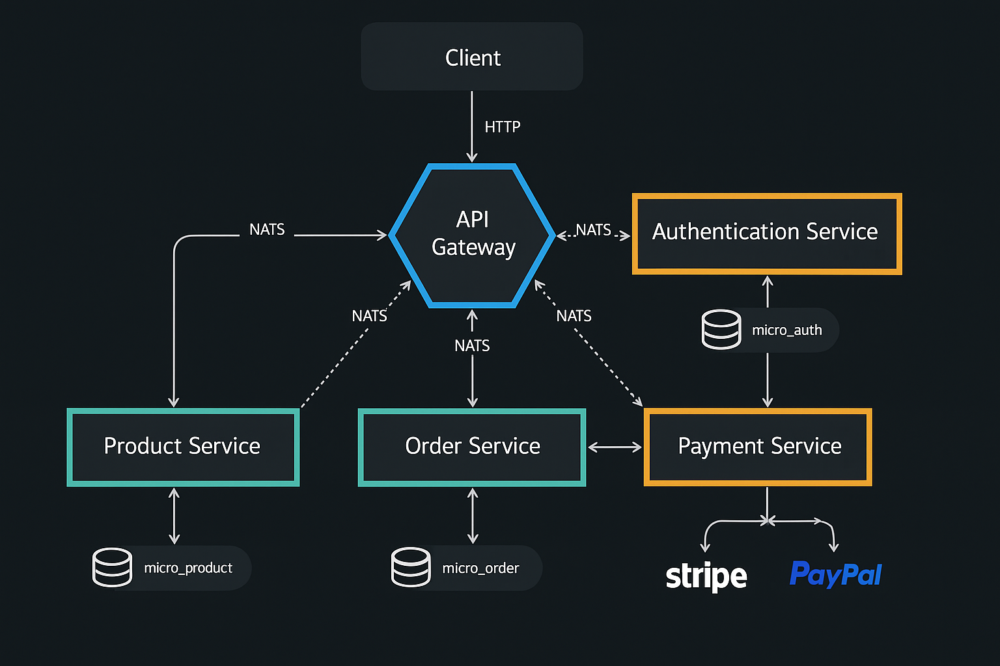

# Sistema E-commerce Basado en Microservicios

> **🌍 English Documentation:** If you prefer to read this documentation in English, see [README.md](./README.md)

## 1. Introducción

Este repositorio contiene la implementación de un sistema backend para una plataforma de e-commerce, diseñado bajo una arquitectura de microservicios. El objetivo es proporcionar una solución escalable, mantenible y resiliente para gestionar funcionalidades clave como autenticación de usuarios, catálogo de productos, procesamiento de órdenes y gestión de pagos.

El sistema está construido utilizando **NestJS (TypeScript)**, aprovechando patrones de diseño modernos como **Clean Architecture (Arquitectura Hexagonal)** y **CQRS**. La comunicación entre servicios se realiza principalmente de forma asíncrona mediante **NATS**, y la persistencia de datos se gestiona con **Prisma ORM**. Todo el entorno está contenedorizado con **Docker** y orquestado mediante **Docker Compose** para facilitar el desarrollo y despliegue.

## 2. Arquitectura General

El sistema sigue un patrón de microservicios, donde cada servicio encapsula una capacidad de negocio específica. Un **API Gateway** actúa como punto único de entrada (Single Point of Entry - SPOE), simplificando la interacción del cliente y proporcionando una capa de seguridad y enrutamiento.

### 2.1. Componentes Principales

* **API Gateway (`api-gateway`):**
  * Expone la API RESTful unificada a los clientes.
  * Enruta las solicitudes a los microservicios correspondientes vía NATS (RPC y eventos).
  * Gestiona la autenticación inicial (validación de JWT).
  * Implementa el versionado de la API (vía URI).
  * Agrega respuestas (si es necesario).
  * Proporciona documentación API centralizada (Swagger/OpenAPI).
* **Auth Microservice (`auth-microservice`):**
  * Responsable del registro, login y validación de usuarios.
  * Genera y verifica tokens JWT.
  * Utiliza Bcrypt para el hashing seguro de contraseñas.
  * Persiste la información del usuario (Prisma/PostgreSQL).
* **Products Microservice (`products-management-microservice`):**
  * Gestiona el ciclo de vida de los productos (CRUD).
  * Valida la existencia y disponibilidad de productos.
  * Persiste datos de productos (Prisma/PostgreSQL).
* **Orders Microservice (`purchases-orders-microservice`):**
  * Procesa las órdenes de compra.
  * Orquesta la creación de órdenes: valida productos (consulta a Products MS), inicia sesión de pago (consulta a Payments MS).
  * Maneja los diferentes estados de una orden (PENDING, PAID, CANCELLED).
  * Actualiza el estado basado en eventos recibidos de Payments MS.
  * Implementa CQRS para separar comandos y consultas.
  * Persiste datos de órdenes (Prisma/PostgreSQL).
* **Payments Microservice (`payments-management-microservice`):**
  * Gestiona la creación y el estado de las sesiones de pago.
  * Interactúa con pasarelas de pago externas (actualmente simulado con `MockStripeAdapter`).
  * Procesa webhooks de pago (simulados o reales).
  * Publica eventos sobre el estado del pago (éxito, fallo) a NATS.
  * Implementa CQRS.

### 2.2. Comunicación

* **Cliente -> API Gateway:** HTTP/REST.
* **API Gateway -> Microservicios:** NATS (Request-Response y Eventos). El Gateway actúa como proxy, traduciendo HTTP a mensajes NATS.
* **Microservicio -> Microservicio:** NATS (Request-Response y Eventos). Ejemplo: Orders MS consulta disponibilidad en Products MS y crea sesión en Payments MS.

### 2.3. Diagrama de Arquitectura



## 3. Stack Tecnológico

* **Lenguaje:** TypeScript
* **Framework:** NestJS v10+
* **Mensajería:** NATS
* **ORM:** Prisma v5+
* **Base de Datos:** PostgreSQL
* **Contenerización:** Docker, Docker Compose
* **Pruebas:** Jest
* **API Docs:** Swagger (OpenAPI)

## 4. Patrones Arquitectónicos y Principios Clave

La arquitectura se fundamenta en los siguientes patrones y principios para asegurar calidad, mantenibilidad y escalabilidad:

### 4.1. Clean Architecture (Arquitectura Hexagonal)

Implementada en los microservicios (notablemente en Auth, Orders, Payments) para lograr una clara separación de conceptos y bajo acoplamiento.

* **Domain Layer:** Contiene la lógica y las entidades del negocio principal, sin dependencias externas. Define interfaces (Ports) para las operaciones requeridas (ej. `UserRepositoryPort`, `PaymentServicePort`).
* **Application Layer:** Orquesta los casos de uso. Implementa la lógica de aplicación utilizando los Ports definidos en el dominio. Aquí residen los Handlers de CQRS.
* **Infrastructure Layer:** Contiene las implementaciones concretas de los Ports (Adapters) y las dependencias externas (frameworks, bases de datos, servicios externos). Ejemplos: `PrismaOrderRepository` (Adapter para `OrderRepositoryPort`), `NatsProductServiceAdapter` (Adapter para `ProductServicePort`), Controladores NestJS, Cliente NATS.

Esta separación permite intercambiar implementaciones (ej. cambiar de ORM, proveedor de mensajería) con mínimo impacto en el núcleo del negocio y facilita las pruebas unitarias del dominio y la aplicación.

### 4.2. CQRS (Command Query Responsibility Segregation)

Aplicado en los microservicios de Órdenes y Pagos utilizando el módulo `@nestjs/cqrs`.

* **Commands:** Representan la intención de cambiar el estado del sistema (ej. `CreateOrderCommand`, `MarkOrderAsPaidCommand`). Son procesados por `CommandHandlers` que contienen la lógica de negocio para la escritura.
* **Queries:** Representan la solicitud de información sin modificar el estado (ej. `FindAllOrdersQuery`, `FindOneOrderQuery`). Son procesados por `QueryHandlers` optimizados para la lectura.

Esto simplifica los modelos, permite optimizar las operaciones de lectura y escritura de forma independiente y mejora la claridad del código.

### 4.3. Event-Driven Communication (Comunicación Orientada a Eventos)

NATS se utiliza como el bus de eventos principal para la comunicación asíncrona entre microservicios, promoviendo el desacoplamiento.

* **Publicación de Eventos:** Servicios como Payments publican eventos de dominio significativos (ej. `PaymentSucceededEvent`, `PaymentFailedEvent`) cuando ocurren cambios de estado relevantes. Esto se realiza a través de un `EventPublisherPort` implementado por `NatsEventPublisher`.
* **Consumo de Eventos:** Otros servicios (como Orders) se suscriben a estos eventos utilizando decoradores como `@EventPattern` de NestJS para reaccionar a dichos cambios (ej. marcar una orden como pagada cuando se recibe `PaymentSucceededEvent`).

## 5. Implementaciones Técnicas Destacadas

* **Inyección de Dependencias (DI):** Gestionada de forma nativa por el contenedor IoC de NestJS. La arquitectura hexagonal facilita la correcta definición e inyección de dependencias a través de los Ports y Adapters.
* **Logging:** Se utiliza el `Logger` integrado de NestJS para registrar información relevante, advertencias y errores en la consola. El sistema está preparado para integrar soluciones de logging estructurado y centralizado (como ELK stack o similar) en un entorno productivo.
* **Resiliencia:**
  * **NATS:** Proporciona una base de resiliencia gracias a sus garantías de entrega ("at-least-once" con JetStream, o configuración específica) y mecanismos de reconexión.
  * **Manejo de Errores:** El uso de `RpcException` y filtros globales (`AllRpcExceptionsFilter`) asegura que los errores en la comunicación NATS sean manejados y propagados adecuadamente.
  * **Consideraciones Adicionales:** Aunque no implementados explícitamente en esta versión, la arquitectura permite incorporar patrones adicionales como **Circuit Breakers** (ej. usando `nestjs/terminus` para health checks que alimenten al circuit breaker) y **Retries** (configurables en el cliente NATS o mediante lógica personalizada) para aumentar la robustez en entornos de producción ante fallos temporales de red o servicios.
* **Seguridad y Autenticación:**
  * Flujo basado en **JWT**.
  * `Auth MS` genera tokens (access y refresh) al hacer login.
  * `API Gateway` protege las rutas usando un `AuthGuard` que valida el token JWT enviado en la cabecera `Authorization: Bearer <token>` mediante comunicación RPC con `Auth MS`.
  * Las contraseñas se almacenan hasheadas usando **Bcrypt**.
* **Persistencia de Datos:**
  * **Prisma ORM:** Utilizado para la interacción con la base de datos de forma type-safe.
  * **Schema & Migrations:** Definidos en `prisma/schema.prisma` y gestionados con `prisma migrate dev`.
  * **Repositorios:** Implementados como Adapters en la capa de infraestructura, siguiendo el patrón Repository.
  * **Base de Datos:** PostgreSQL para desarrollo y producción (definido en `docker-compose.yml`), con bases de datos separadas para cada microservicio que garantizan la independencia de datos.
* **Versionado de API:** Implementado en el `API Gateway` mediante versionado por URI (`/api/v1/...`), permitiendo introducir cambios sin romper la compatibilidad con clientes existentes.
* **Manejo de Excepciones:** Filtros globales (`AllHttpExceptionsFilter` en Gateway, `AllRpcExceptionsFilter` en microservicios) capturan excepciones no manejadas y devuelven respuestas de error estandarizadas y consistentes.
* **Documentación API (Swagger):** El `API Gateway` utiliza `@nestjs/swagger` para generar automáticamente una descripción OpenAPI (Swagger UI) interactiva, accesible en `/api/docs`. Los DTOs están decorados (`@ApiProperty`) para enriquecer la documentación.
* **Validación:** Se utiliza `class-validator` y `class-transformer` en los DTOs para validar automáticamente los datos de entrada en el API Gateway y en los microservicios.
* **Testing:** El proyecto incluye pruebas unitarias y E2E (`*.spec.ts`, `*.e2e-spec.ts`) configuradas con Jest, asegurando la correctitud de la lógica de negocio y la integración entre componentes.

## 6. Configuración y Ejecución Local

### Prerrequisitos

* Docker
* Docker Compose v2+
* Node.js (para gestión de paquetes si se modifica el código)
* NPM o Yarn

### Pasos para Ejecutar

1. **Clonar el Repositorio:**

    ```bash
    git clone --recurse-submodules https://github.com/ecomerse-microservice/order-management-system.git
    cd order-management-system
    ```

    Si ya clonaste sin submódulos, ejecuta:
    ```bash
    git submodule init
    git submodule update
    ```

2. **Construir y Levantar los Contenedores:**
    Desde la raíz del proyecto (donde se encuentra `docker-compose.yml`):

    ```bash
    docker-compose up --build -d
    ```

    Este comando construirá las imágenes de Docker para cada microservicio y el API Gateway, y levantará los contenedores junto con el servidor NATS.

3. **Acceder a los Servicios:**
    * **API Gateway (Swagger UI):** `http://localhost:3000/api/docs`
    * **API Gateway (Endpoints):** `http://localhost:3000/api/v1/...`
    * **NATS Monitoring (Opcional):** Si se expone, generalmente en `http://localhost:8222` (depende de la configuración de NATS en `docker-compose.yml`).

4. **Detener los Contenedores:**

    ```bash
    docker-compose down
    ```

## 7. Conclusión

Este proyecto presenta una implementación robusta y bien estructurada de un sistema de e-commerce utilizando microservicios con NestJS. La adopción de Clean Architecture, CQRS, comunicación basada en eventos con NATS y otras buenas prácticas resulta en una base sólida, escalable y mantenible, adecuada para aplicaciones empresariales modernas.
